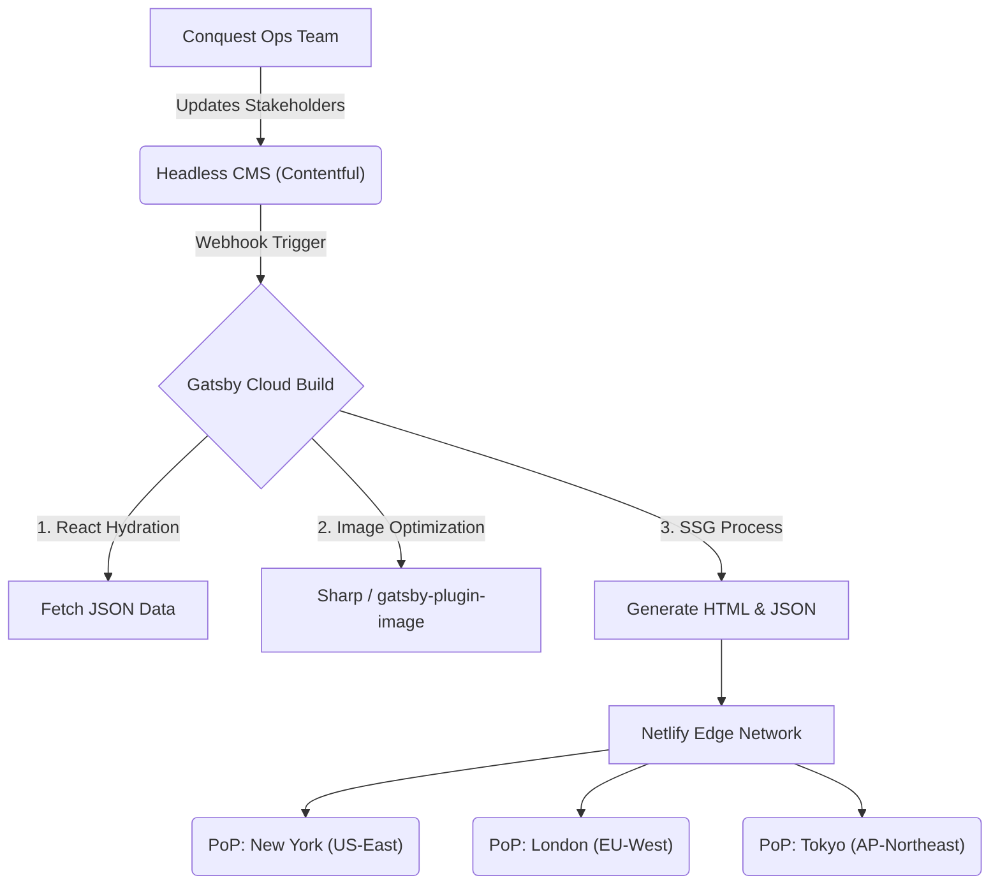

# Performance Strategy: The "Invisible Pipeline"

This document explains the infrastructure that keeps the Conquest website fast and consistently up-to-date.

## The Deployment Model

Traditional web servers generate pages on demand—like a restaurant cooking to order. If the kitchen gets swamped, everyone waits.

Conquest works more like a vending machine. The content is pre-packaged and ready to go. When a user requests a page, it is delivered instantly without any server-side processing delay.

### The Build Pipeline

## Optimization Techniques

### Image Processing
We avoid serving large 4K images to mobile devices. The build system automatically generates multiple versions of every uploaded image (small, medium, large) and converts them to modern formats like WebP. This reduces file size by roughly 30% without visible quality loss.

### The "App Shell" Architecture
When the site loads, we send the "Shell"—the header, footer, and navigation—first because it is small. We then inject the content. When a user navigates to a new page, we keep the Shell and only swap the content. This creates a smooth, native app-like experience.

### Caching Strategy
Assets like images and fonts are cached on the user's device for up to a year. Returning visitors download almost nothing. Text content is refreshed globally every time we deploy a new version, ensuring users always see the latest information without stale data issues.
